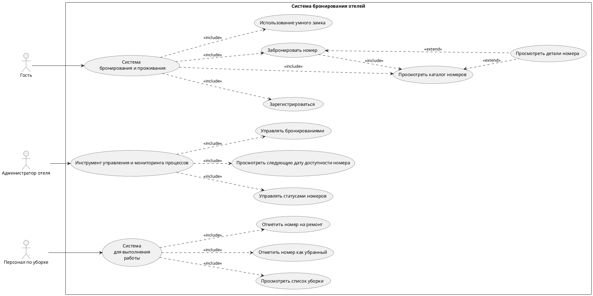

## Тема: 
Крупная компания разрабатывает систему бронирования и управления отелями премиум-класса.
## Перечень заинтересованных лиц (стейкхолдеров)

1. **Гость** — конечный потребитель услуги, который бронирует и проживает в номере отеля. *Заинтересован в удобстве, прозрачности и персонализации процесса бронирования и проживания.*

2. **Администратор отеля** — сотрудник отеля, который управляет бронированиями, статусами номеров и взаимодействует с гостями. *Заинтересован в централизованном и эффективном инструменте управления.*

3. **Персонал по уборке и обслуживанию** — сотрудник, ответственный за подготовку номеров к заселению. *Заинтересован в четком и понятном процессе выполнения своей работы.*

4. **Менеджер компании по бронированию** — лицо, отвечающее за успех системы в целом. *Заинтересован в повышении доходов, удовлетворенности гостей, операционной эффективности и быстром выводе системы на рынок.*

5. **Технический специалист / Администратор системы** — отвечает за развертывание, поддержку и бесперебойную работу системы. *Заинтересован в надежности, безопасности и простоте обслуживания.*

6. **Конкуренты компании** — другие компании на рынке бронирования отелей и управления гостиницами. *Заинтересованы в получении информации о новых внедренных технологических решениях аналогов.*

---

## Перечень функциональных требований

### Для Гостя:
- Система должна предоставлять гостю возможность регистрации через веб-интерфейс и мобильное приложение.
- Система должна предоставлять гостю каталог номеров с фильтрацией по типу: стандартный, комфортный, люкс.
- Система должна предоставлять гостю детальную страницу для каждого номера, включающую фотогалерею, план расположения номера в отеле и описание.
- Система должна позволять гостю выбрать для бронирования либо тип номера, либо конкретный номер из доступных.
- Система должна предоставлять гостю возможность использовать мобильное приложение для использования умного замка в своем номере.

### Для Администратора отеля:
- Система должна предоставлять интерфейс для ручного управления статусами номеров: доступен, забронирован, требуется уборка, на обслуживании.
- Система должна отображать «следующую дату доступности» для каждого номера на основе календаря бронирований.
- Система должна предоставлять панель управления для просмотра и управления всеми текущими и будущими бронированиями.

### Для Персонала по уборке:
- Система должна предоставлять специализированный интерфейс на запатентованном устройстве, который предоставляет список номеров, требующих уборки.
- Система должна автоматически присваивать приоритет заданиям на уборку на основе времени ближайшего заселения.
- Система должна позволять персоналу отмечать номер как «убранный» или «требующий ремонта», что автоматически изменяет его статус в основной системе.

### Интеграционные требования:
- Система должна интегрироваться с существующей системой бронирования для обработки платежей и хранения регистрационной информации гостя.

---

## Диаграмма вариантов использования

## Перечень сделанных предположений

1. **Интеграция с умными замками**  
   Предполагается, что система сможет отправлять одноразовые цифровые ключи на мобильное приложение гостя для открытия умных замков, и что API этих замков документирован и доступен.

2. **Надежность существующей системы**  
   Предполагается, что существующая система бронирования стабильна, имеет хорошо описанный API для интеграции и способна выдержать дополнительную нагрузку от новой системы.

3. **Инфраструктура и устройства**  
   Предполагается, что на хостинге компании есть достаточные мощности для развертывания системы, а "запатентованные устройства" для персонала совместимы с разрабатываемым ПО.

4. **Авторизация и роли**  
   Предполагается, что в системе будет реализована модель разграничения прав доступа для гостей, администраторов и персонала уборки.

5. **Доступность интернета**  
   Предполагается, что и гости, и персонал отеля будут иметь стабильный доступ в Интернет для работы с системой.

## Перечень нефункциональных требований

### Производительность
**Требование:**  
Время отклика системы (загрузка страниц, выполнение операций бронирования, обновление статусов) для любого пользователя не должно превышать 2 секунд в 95% случаев.

**Обоснование:**  
Прямо влияет на удовлетворенность гостей и эффективность работы персонала. Особенно критично в пиковый сезон при высокой нагрузке.

### Надежность
**Требование:**  
Система должна иметь доступность на уровне 99.5% в рабочее время отеля. Резервное копирование данных должно выполняться ежедневно.

**Обоснование:**  
Простой системы означает прямые финансовые потери, срыв уборки и падение репутации премиального сервиса. Требование к быстрому развертыванию делает целесообразным начать с высокого, но достижимого уровня доступности.

### Удобство использования
**Требование:**  
Веб-интерфейс для гостей и администраторов должен корректно отображаться и функционировать на последних стабильных версиях браузеров Chrome, Safari, Firefox и Edge, а также на мобильных устройствах с iOS не ниже версии 14 и Android не ниже версии 10. Интерфейс для запатентованных устройств персонала должен быть реализован в виде адаптивного веб-приложения, совместимого с указанными техническими характеристиками (разрешение экрана, версия ОС).

**Обоснование:**  
Это требование гарантирует, что система будет доступна всем целевым пользователям на их устройствах, что является базовым условием для "удобства использования". Оно полностью объективно и проверяемо.

### Безопасность
**Требование:**  
Все передаваемые данные, особенно персональные данные гостей и данные для открытия замков, должны шифроваться с использованием современных протоколов (HTTPS/TLS). Доступ к данным и функциям должен строго контролироваться системой аутентификации и авторизации.

**Обоснование:**  
Утечка данных гостей или уязвимость в системе управления замками нанесет непоправимый ущерб репутации премиального бренда. Это одно из ключевых требований для систем, работающих с персональными данными и физической безопасностью.

